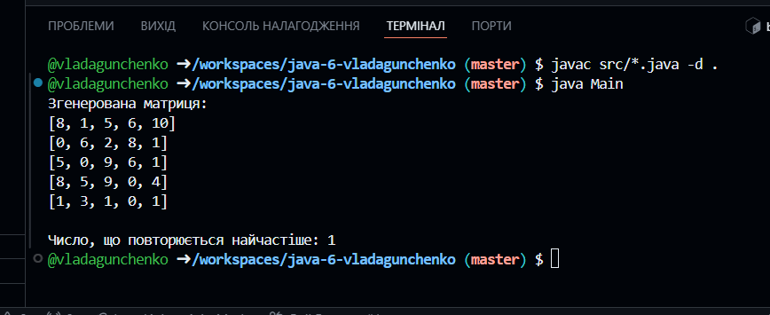

# Практична робота: Поглиблене використання масивів
**Виконала:** Гунченко Владислава 35 група
**Завдання:** №3 (Знайти в матриці число, яке повторюється найбільшу кількість разів)

## Опис рішення
Програма складається з двох класів:
1. `MatrixTask` — містить універсальну логіку пошуку без використання призначеного для користувача інтерфейсу.
2. `Main` — тестовий клас для перевірки працездатності.

### Використані технології:
- **Arrays.setAll** та **лямбда-вирази** для автоматичної генерації випадкової матриці без використання стандартних циклів.
- **Java Stream API (flatMapToInt)** для перетворення двовимірного масиву в одновимірний.
- **Arrays.sort()** для швидкого групування однакових елементів перед аналізом.

## Візуалізація алгоритму
Для знаходження найчастішого числа дані проходять через такий ланцюжок:

1. **Генерація** (Matrix NxM) -> 2. **Flattening** (Масив 1D) -> 3. **Sorting** (Групування) -> 4. **Count** (Пошук максимуму) 

